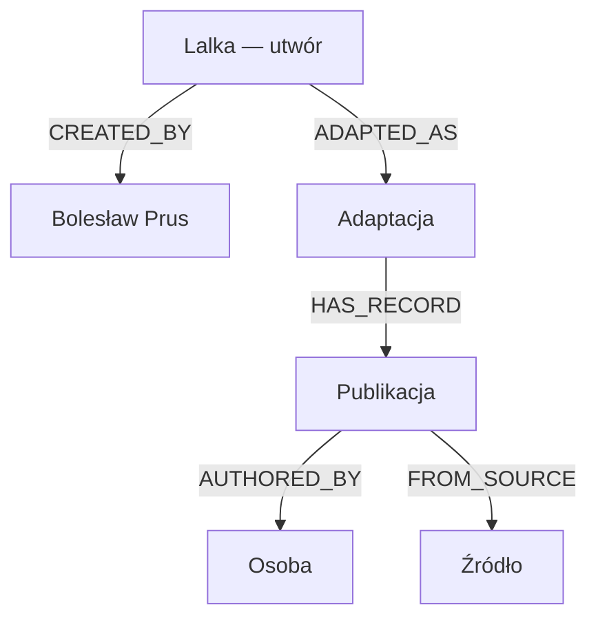
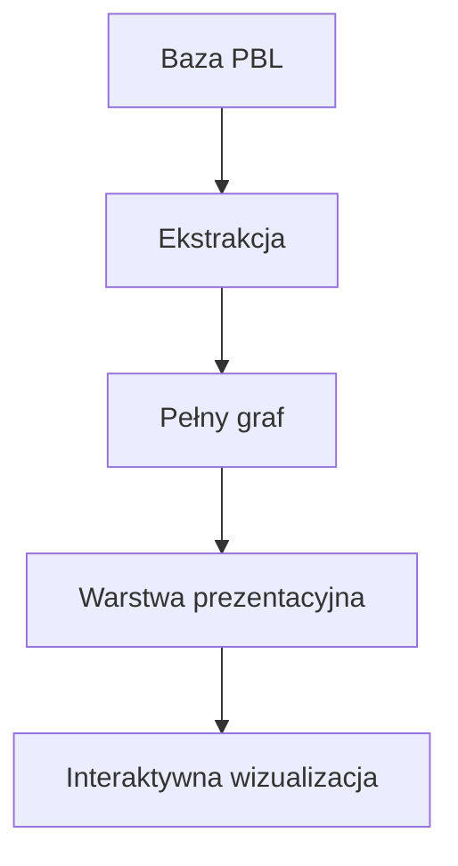

# Lalka Knowledge Graph

**Lalka Knowledge Graph** to eksperymentalny projekt pokazujący, jak rekordy [Polskiej Bibliografii Literackiej (PBL)](https://pbl.ibl.poznan.pl/) można przekształcić w graf relacji między utworem, jego twórcą, adaptacjami ekranowymi, publikacjami, osobami, wydawcami i źródłami bibliograficznymi.

Projekt wykorzystuje „Lalkę” Bolesława Prusa jako studium przypadku. Jego wynikiem jest pełniejszy graf zachowujący strukturę danych PBL, uproszczona warstwa prezentacyjna oraz interaktywna wizualizacja.

## Interaktywna wizualizacja

**[Otwórz Lalka Knowledge Graph](https://polskabibliografialiteracka.github.io/lalka-knowledge-graph/)**

Wizualizacja została przygotowana do przeglądania w przeglądarce i udostępniona za pomocą GitHub Pages. Umożliwia filtrowanie typów obiektów, wyszukiwanie węzłów oraz sprawdzanie relacji i podstawowych informacji o rekordach.

## Co przedstawia graf?

Punktem centralnym grafu jest „Lalka” jako utwór literacki. Z utworem powiązane są:

- Bolesław Prus jako jego twórca;
- dwie zidentyfikowane w PBL adaptacje ekranowe;
- publikacje i inne rekordy bibliograficzne związane z utworem lub adaptacjami;
- osoby odpowiedzialne za publikacje;
- wydawcy;
- czasopisma i inne źródła bibliograficzne.

Warstwa prezentacyjna obejmuje obecnie:

| Typ obiektu | Liczba |
|---|---:|
| Utwór | 1 |
| Adaptacje | 2 |
| Publikacje | 104 |
| Osoby | 75 |
| Źródła | 64 |
| Wydawcy | 10 |
| **Wszystkie węzły** | **256** |
| **Relacje** | **312** |

Liczby pochodzą z metadanych zapisanych w pliku `data/lalka_presentation_graph.json`.

## Cel projektu

Projekt służy sprawdzeniu, jak dane bibliograficzne zapisane pierwotnie jako rekordy i hierarchie można przedstawić jako sieć obiektów i relacji.

Graf pozwala zadawać pytania inne niż podczas przeglądania pojedynczego rekordu, na przykład:

- jakie obiekty są powiązane z „Lalką”;
- jakie adaptacje ekranowe zostały zarejestrowane w PBL;
- jakie publikacje dotyczą konkretnej adaptacji;
- kto jest autorem danej publikacji;
- w jakim źródle została ona odnotowana.

Projekt nie zastępuje modelu danych ani interfejsu PBL. Jest eksperymentem dotyczącym alternatywnego sposobu przetwarzania, modelowania i prezentowania danych bibliograficznych.

## Model grafu

Warstwa prezentacyjna wykorzystuje następujące typy węzłów:

| Typ | Znaczenie |
|---|---|
| `Work` | utwór literacki |
| `Person` | twórca utworu lub osoba związana z publikacją |
| `Adaptation` | adaptacja ekranowa |
| `Publication` | publikacja lub inny rekord bibliograficzny |
| `Event` | wydarzenie |
| `Publisher` | wydawca |
| `Source` | czasopismo lub inne źródło bibliograficzne |

Najważniejsze relacje:

| Relacja | Znaczenie |
|---|---|
| `CREATED_BY` | utwór został stworzony przez osobę |
| `ADAPTED_AS` | utwór został zaadaptowany |
| `HAS_RECORD` | adaptacja ma powiązany rekord bibliograficzny |
| `RELATED_TO` | rekord bibliograficzny jest związany z utworem |
| `AUTHORED_BY` | publikacja ma autora |
| `PUBLISHED_BY` | publikacja została wydana przez wydawcę |
| `FROM_SOURCE` | rekord pochodzi ze wskazanego źródła |



Diagram przedstawia fragment modelu. Publikacje mogą być również bezpośrednio powiązane z utworem relacją `RELATED_TO` oraz z wydawcą relacją `PUBLISHED_BY`.

## Warstwy danych

Projekt rozdziela dane wyodrębnione z PBL od modelu przeznaczonego dla użytkownika:



- `data/lalka_graph.json` zachowuje techniczne typy obiektów i relacje wynikające ze struktury danych PBL;
- `data/lalka_presentation_graph.json` upraszcza ten model na potrzeby wizualizacji;
- `docs/index.html` zawiera opublikowaną wersję interaktywnego grafu.

Relacja `CHILD_OF`, wykorzystywana w PBL do zapisu hierarchii rekordów, pozostaje w pełnym grafie. W warstwie prezentacyjnej jest zastępowana relacjami łatwiejszymi do interpretacji przez użytkownika.

Niektóre relacje dotyczące adaptacji zostały zweryfikowane i dodane ręcznie, ponieważ nie można było ich wiarygodnie odtworzyć wyłącznie na podstawie hierarchii rekordów. Informacja o tych relacjach jest zachowana w metadanych warstwy prezentacyjnej.

## Zakres i ograniczenia danych

Graf przedstawia określony wycinek PBL, a nie pełną bibliografię „Lalki”. Zakres ekstrakcji został wyznaczony przez:

- rekord utworu „Lalka” o identyfikatorze PBL `109715`;
- rekordy Bolesława Prusa o identyfikatorach `3426` i `1082`;
- adaptacje ekranowe o identyfikatorach `304249` i `136679`;
- ustaloną liczbę poziomów hierarchii pobieranych dla poszczególnych grup rekordów.

Obecny graf nie powinien być traktowany jako kompletny wykaz wszystkich wydań książkowych „Lalki”, wszystkich adaptacji ani całej recepcji utworu. Pokazuje rekordy osiągalne zgodnie z przyjętymi regułami ekstrakcji i modelowania.

Dane zostały wyodrębnione 28 sierpnia 2026 roku. Liczebność zbiorów wejściowych i parametry ekstrakcji zapisano w `data/lalka_extraction_metadata.json`.

## Struktura repozytorium

```text
lalka-knowledge-graph/
├── assets/
│   └── pbl-logo.png
├── data/
│   ├── lalka_records_raw.json
│   ├── lalka_authors_raw.json
│   ├── lalka_creators_raw.json
│   ├── lalka_publishers_raw.json
│   ├── lalka_extraction_metadata.json
│   ├── lalka_graph.json
│   └── lalka_presentation_graph.json
├── docs/
│   └── index.html
├── scripts/
│   ├── extract_lalka.py
│   ├── inspect_lalka_data.py
│   ├── build_graph.py
│   ├── inspect_graph.py
│   ├── build_presentation_graph.py
│   ├── inspect_presentation_graph.py
│   └── visualize_graph.py
├── .gitignore
└── README.md
```

## Przetwarzanie danych

Skrypty należy uruchamiać z głównego katalogu projektu.

### 1. Ekstrakcja danych z PBL

```bash
python scripts/extract_lalka.py
```

Ten etap wymaga dostępu do bazy Oracle PBL oraz skonfigurowania zmiennych środowiskowych:

```text
PBL_ORACLE_HOST
PBL_ORACLE_PORT
PBL_ORACLE_SERVICE
PBL_ORACLE_USER
PBL_ORACLE_PASSWORD
PBL_ORACLE_LIB_DIR
```

Dane dostępowe nie są przechowywane w repozytorium. Osoby bez dostępu do bazy mogą korzystać z plików JSON zapisanych w katalogu `data` i rozpocząć pracę od budowy grafu.

### 2. Inspekcja danych wejściowych

```bash
python scripts/inspect_lalka_data.py
```

### 3. Budowa i kontrola pełnego grafu

```bash
python scripts/build_graph.py
python scripts/inspect_graph.py
```

### 4. Budowa i kontrola warstwy prezentacyjnej

```bash
python scripts/build_presentation_graph.py
python scripts/inspect_presentation_graph.py
```

### 5. Generowanie wizualizacji

```bash
python scripts/visualize_graph.py
```

Skrypt wykorzystuje dane z `data/lalka_presentation_graph.json` i tworzy interaktywny plik HTML w katalogu `docs`.

Projekt wykorzystuje Python, SQL, JSON, Oracle Database, pandas, NetworkX, Pyvis, Beautiful Soup oraz HTML/JavaScript.

## Źródło danych

Źródłem danych jest [Polska Bibliografia Literacka](https://pbl.ibl.poznan.pl/), prowadzona przez Pracownię Bibliografii Bieżącej Instytutu Badań Literackich PAN.

Dane PBL nie są modyfikowane w bazie źródłowej. Projekt przetwarza ich wyodrębnioną kopię do kolejnych warstw przeznaczonych do analizy i wizualizacji.

## Status projektu

Projekt znajduje się w fazie eksperymentalnej i jest rozwijany iteracyjnie. Model grafu, zakres danych oraz sposób wizualizacji mogą się zmieniać wraz z kolejnymi etapami prac.
